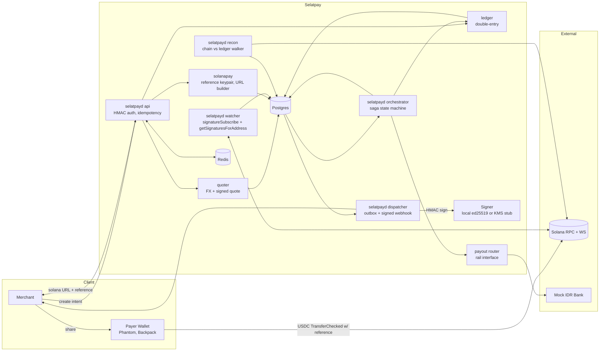
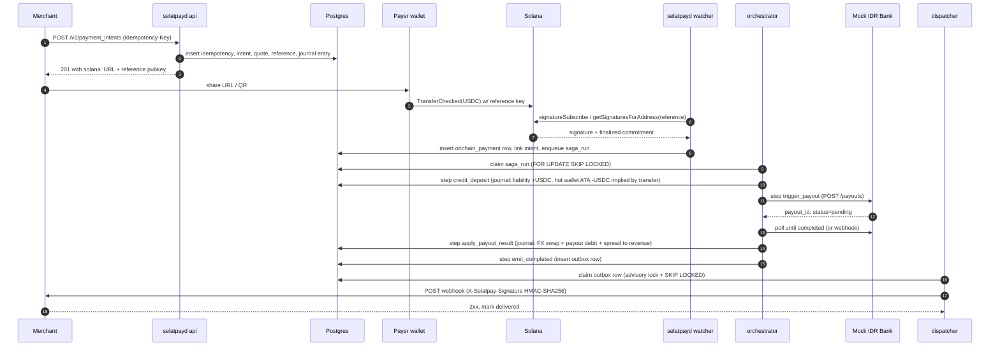

# Architecture

This document is the operational map of Selatpay. It assumes you have read the project [README](../README.md) and want to understand how the parts fit together. For the reasoning behind each major decision, see the [ADR index](adr/README.md).

## Components

Every selatpayd subcommand is the same binary with a different role. Postgres is the only persistent store; Redis is a cache for idempotency and a place for distributed locks if we ever need them outside Postgres advisory locks.

## Single-binary subcommands

| Subcommand | Role | Concurrency model |
| --- | --- | --- |
| `selatpayd api` | REST API (HMAC auth, idempotency middleware), payment intent creation, intent fetch | One or more replicas behind a load balancer; stateless |
| `selatpayd watcher` | Solana RPC / WS subscriber, links finalized deposits to intents, enqueues saga | Single replica per environment (signature processing is idempotent so multi-replica is safe but unnecessary) |
| `selatpayd orchestrator` | Saga runner, claims `saga_runs` rows with `FOR UPDATE SKIP LOCKED`, advances steps inside one transaction with the ledger and outbox | Multi-replica; lease-based work distribution |
| `selatpayd dispatcher` | Outbox drainer, holds a per-topic `pg_try_advisory_lock`, signs and delivers webhooks | One active drainer per topic; replicas idle on lock contention |
| `selatpayd recon` | Walks on-chain transfers and ledger postings, reports drift | Periodic, idempotent |

## Happy-path sequence

Each step the orchestrator runs is one Postgres transaction that writes:

1. The saga state advance.
2. The ledger postings for that step (if any).
3. The outbox rows for that step (if any).

If the transaction commits, all three changes are visible. If it does not, none of them are. This is the load-bearing invariant of the design.

## Data model

The full schema is in `internal/db/migrations/`. The load-bearing tables:

| Table | Purpose |
| --- | --- |
| `accounts` | Chart of accounts. Pinned by `(code, currency)`. Account types: asset, liability, equity, revenue, expense |
| `journal_entries` | Immutable ledger headers. `external_ref` enforces idempotent posting |
| `postings` | Double-entry lines. Currency-match trigger row-local; balanced-entry trigger deferred to commit |
| `merchants`, `merchant_bank_details`, `merchant_webhook_config` | Merchant identity and per-merchant integration config |
| `payment_intents` | Intent state machine: pending -> funded -> settling -> paid_out -> completed (or expired, failed) |
| `quotes` | Signed FX quotes (HMAC over canonical bytes); rejected at intent creation if expired or tampered |
| `idempotency_keys` | Per-merchant request deduplication; stores fingerprint and cached response (ADR-0005) |
| `onchain_payments` | One row per signature observed for a tracked reference; commitment progresses processed -> confirmed -> finalized |
| `saga_runs` | Saga state and lease. One row per intent in flight |
| `outbox` | Durable side-effect queue. Drained per topic by the dispatcher (ADR-0004) |
| `payouts` | Payout rail bookkeeping; one row per orchestrator-initiated payout, references `payment_intents` |

## Failure semantics

| Class | What we do |
| --- | --- |
| Transient RPC failure (Solana, bank rail) | Step returns retry; saga `next_run_at` is bumped via exponential backoff with jitter (`internal/saga/backoff.go`) |
| Permanent rail rejection (e.g. invalid bank account) | Step returns permanent; saga short-circuits to `failed` and a refund flow is queued (refund flow itself is out of scope for v1) |
| Worker crash mid-step | Lease expires; another orchestrator picks the row up via `FOR UPDATE SKIP LOCKED`. Steps are idempotent because they key writes by `(intent_id, step_name)` |
| Webhook delivery failure | Dispatcher records `last_error`, increments `attempts`, schedules next attempt; consumer dedupes on the `Idempotency-Key` we send |
| RPC reorg below finalized commitment | Watcher only credits at finalized; sub-finalized signatures are observed but not actioned |
| On-chain vs ledger drift | `selatpayd recon` reports it; the report is the trigger for human investigation |

## Where to read what

- API contract: [`api/openapi.yaml`](../api/openapi.yaml).
- ADRs (decision records): [`docs/adr/`](adr/README.md).
- Demo walkthrough: [`docs/demo.md`](demo.md).
- Migrations and queries: [`internal/db/migrations/`](../internal/db/migrations) and [`internal/db/queries/`](../internal/db/queries).
- Saga steps: [`internal/saga/steps/`](../internal/saga/steps).
- Solana Pay primitives: [`internal/solanapay/`](../internal/solanapay).
- Outbox dispatcher: [`internal/outbox/dispatcher.go`](../internal/outbox/dispatcher.go).
- Reconciliation walker: [`internal/recon/`](../internal/recon).
